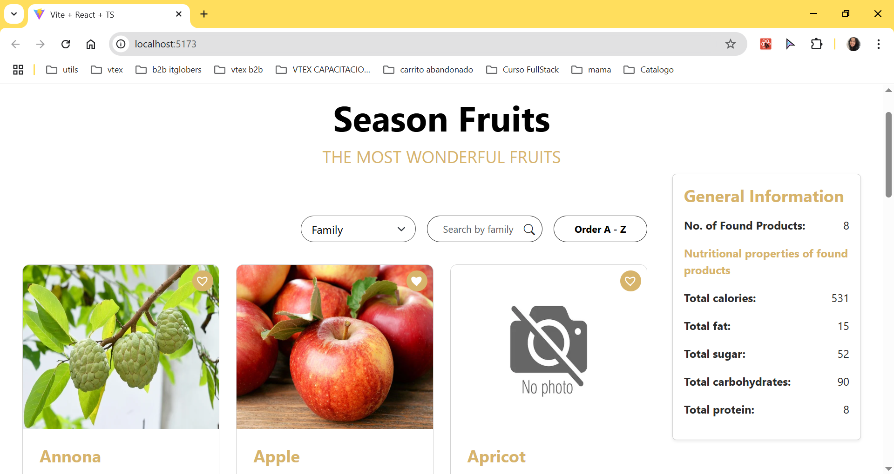

# Season Fruits – Landing Page ReactJS
Landing page en React + Vite que consume la API Fruityvice para mostrar frutas de temporada.



---

## Prerequisitos

- **Node.js** v10.9.2 

> Estas versiones fueron usadas para desarrollar y testear el proyecto. 
---

## Tecnologías

- **React 18** + **Vite**  
- **TypeScript**  
- **Hooks personalizados:**  
  - `useFetchFruits` (consumo API)  
  - `useFilteredFruits` (filtrado/orden)  
  - `useTakeImage` (fallback de extensiones)  
  - `useLikedFruits` (persistencia “me gusta” en localStorage)  
- **Estilos:** Bootstrap 5 + CSS  
- **Tests:** Jest + @testing-library/react + ts-jest

---

## Instalación ¡rápida!

```bash
git clone https://github.com/ciyucapa/FruitsWeb.git
cd FruitsWeb
npm install
npm run dev

Abre http://localhost:5173 en tu navegador.
```
---

## Usos

  1. Filtrar por Family / Order / Genus
  2. Buscar texto dentro de la categoría seleccionada
  3. Order A-Z / Z-A con un clic
  4. See more: carga 4 frutas más cada vez
  5. Me gusta: persiste en localStorage
  6. General Information: totales nutricionales de lo visible

---

## Test

  # Correr todos los tests
  npm run test

  # Correr un test específico
  npm run test -- src/components/FilterAndSortedFruits/FilterAndSortedFruits.test.tsx

---

## Configuración de Proxy CORS (Solo para Desarrollo)

La API de Fruityvice puede bloquear solicitudes directas desde `localhost` debido a restricciones de CORS. Para solventarlo durante el desarrollo, puedes usar el proxy de CORS Anywhere:

1. Abre en tu navegador: https://cors-anywhere.herokuapp.com/corsdemo  
2. Haz clic en **“Request temporary access to the demo server”**.  
3. En tu hook de la API (`useFetchFruits.tsx`), ajusta la URL así:

   ```ts
   const API_URL =
     'https://cors-anywhere.herokuapp.com/https://www.fruityvice.com/api/fruit/all';
  ```

4. Reinicia el servidor de desarrollo:
  ```
    npm run dev
  ```
5. Refresca tu aplicación en http://localhost:5173. Las llamadas a la API ya deberían funcionar.
Nota: Este proxy es solo para desarrollo local. Para producción, configura tu propio proxy o llama directamente a la API si CORS lo permite.

---

